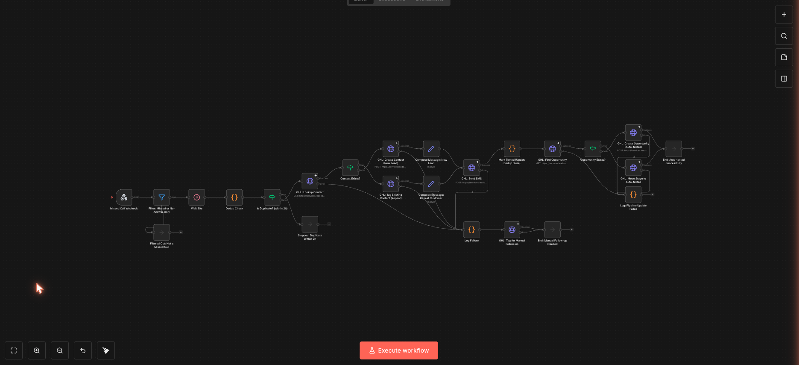

# Missed Call Text-Back Automation

An n8n workflow that catches a missed call to a local service business, waits for a real callback window, and texts the customer back automatically — before they call the next business on Google.

Built for the pressure-washing case study on [Spark Automation](https://spark-automation-site.vercel.app), and live-tested against a real phone number.

## What it does

A missed call triggers a webhook, waits 30 seconds for a real callback window, dedupes repeat callers, looks up or creates the GoHighLevel contact, sends the right message to a new lead vs. a returning customer, creates/updates the pipeline opportunity, and logs failures for manual follow-up instead of failing silently. 24 nodes end to end.

## How this was built

Built through a genuine back-and-forth with Claude — ideas for direction, tone, and what to lead with were proposed and then tested and validated against what would actually land with a real business owner, not accepted on a first pass. The live deploy was checked before it went anywhere near an actual sales call.

This went through two real failures before being called done: a wrong field path silently rejected every real call, and later a dead webhook tunnel did the same. Both were only caught by tracing a live phone call through n8n's execution history and GHL's execution logs — not by trusting that "no visible errors" meant it worked.

## About the export

Account-specific identifiers (GHL location ID, pipeline ID, stage ID, credential reference, and stored phone numbers) have been replaced with placeholders in `missed-call-text-back.json`. The real workflow runs on a private n8n instance against a live GoHighLevel account — this file is for showing the logic and structure, not for re-importing and running as-is.

To run it for real, you'd need your own GHL account, your own credential set up in n8n, and your own pipeline/stage IDs swapped back in.
